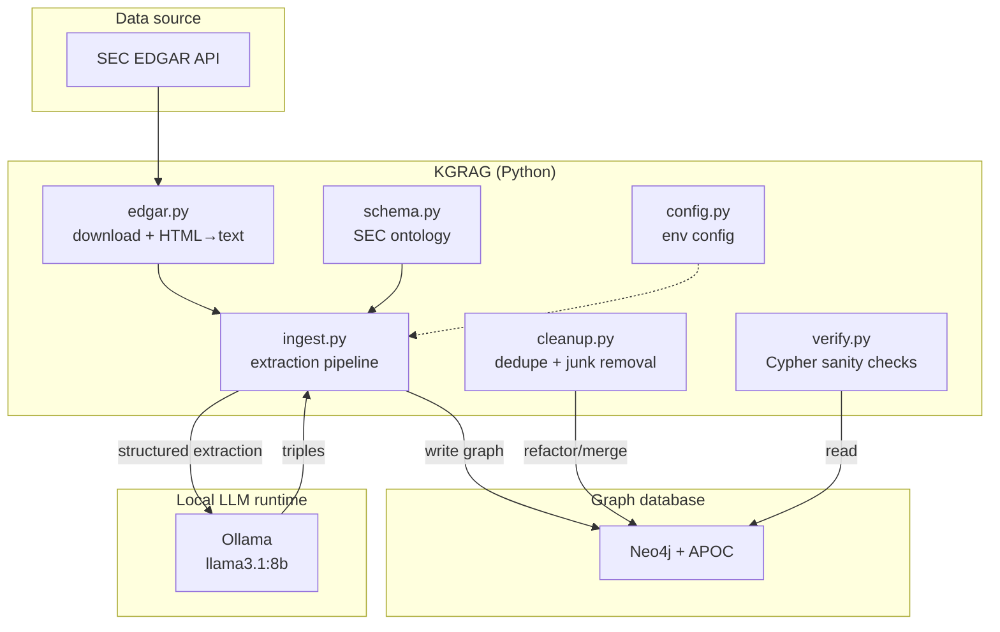
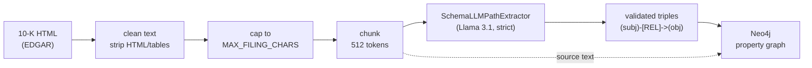
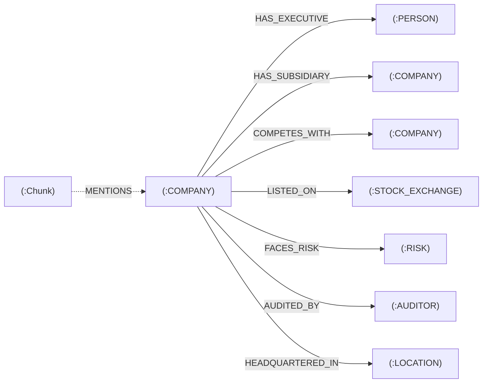
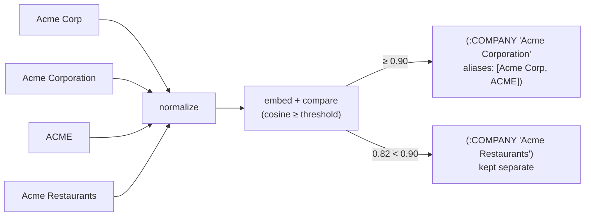

# KGRAG — Architecture

Knowledge Graph RAG for enterprise data (SEC filings), built entirely on free,
open-source, locally-run components.

---

## 1. Goal

Turn unstructured enterprise documents (SEC 10-K filings) into a **queryable
knowledge graph** so that relationship- and multi-hop questions — the kind
vanilla vector RAG cannot answer — can be answered accurately and with
traceable provenance.

Example questions the graph is designed to serve:
- "Which companies compete with each other, and in which segments?"
- "Who are the executives of companies that face supply-chain risk?"
- "What subsidiaries does company X own, and where are they located?"

---

## 2. Design principles

| Principle | How it shows up |
|---|---|
| **Zero cost** | Every component is open-source and runs locally — no paid API. |
| **Schema-first** | A fixed ontology constrains extraction, so the graph stays clean and queryable. |
| **Provenance** | Every extracted fact links back to its source text chunk. |
| **Swappable parts** | LLM, graph store, and data source are isolated behind small modules. |
| **Deterministic cleanup** | Value-level noise from a small local model is fixed with rules, not more LLM calls. |

---

## 3. Technology stack

| Layer | Technology | Cost |
|---|---|---|
| Extraction LLM | **Ollama + Llama 3.1 8B** (local) | Free |
| Orchestration | **LlamaIndex** (`PropertyGraphIndex`, `SchemaLLMPathExtractor`) | Free (OSS) |
| Graph database | **Neo4j 5 Community** + APOC (Docker) | Free |
| Data source | **SEC EDGAR** REST API | Free (public) |
| Language | Python 3.10+ | Free |

---

## 4. Component overview



---

## 5. Ingestion pipeline (Phase 1)

The core data flow, per company:



**Steps**

1. **Resolve** ticker → CIK via EDGAR's `company_tickers.json`.
2. **Locate** the latest 10-K from the submissions API and download the primary
   document.
3. **Clean** — strip scripts/styles/tables, collapse whitespace; cache the text
   under `data/` so re-runs never re-hit EDGAR.
4. **Chunk** into 512-token nodes (small chunks keep each local-LLM call fast and
   reliable).
5. **Extract** with `SchemaLLMPathExtractor` in `strict` mode — the LLM may only
   emit entities/relations from the ontology, and only triples whose
   `(subject, relation, object)` types appear in the validation schema.
6. **Write** entities, relationships, and source `Chunk` nodes into Neo4j.

---

## 6. The ontology (`schema.py`)

The single most important quality lever. Extraction is constrained to:

**Entity types (9):** `COMPANY`, `PERSON`, `PRODUCT`, `SEGMENT`, `RISK`,
`AUDITOR`, `LOCATION`, `GOVERNMENT_AGENCY`, `STOCK_EXCHANGE`

**Relationship types (15):** `HAS_SUBSIDIARY`, `COMPETES_WITH`, `PARTNERS_WITH`,
`ACQUIRED`, `SUPPLIES_TO`, `HAS_EXECUTIVE`, `HAS_DIRECTOR`, `OFFERS_PRODUCT`,
`OPERATES_SEGMENT`, `FACES_RISK`, `AUDITED_BY`, `HEADQUARTERED_IN`,
`OPERATES_IN`, `REGULATED_BY`, `LISTED_ON`

**Validation schema** — a whitelist of allowed triple shapes, e.g.
`(COMPANY)-[HAS_EXECUTIVE]->(PERSON)`, `(COMPANY)-[FACES_RISK]->(RISK)`.
`strict=True` rejects anything not on the list, which is what keeps the graph
consistently queryable instead of a pile of arbitrary edges.

---

## 7. Graph data model (in Neo4j)



- **Entity nodes** carry `name`, `id` (= name), plus metadata (`source`,
  `ticker`, `company`, `triplet_source_id`).
- **`Chunk` nodes** hold the original source text and link to the entities they
  mention via `MENTIONS` — this is the provenance trail from any fact back to
  the exact passage it came from.
- **Every edge is citable.** Each knowledge relationship carries
  `triplet_source_id`, which resolves to the `Chunk` whose text justified it —
  so any edge can be traced to the exact sentence behind it.
- **Ingestion is idempotent.** The store writes with `MERGE` (via APOC), not
  `CREATE`, so entities and edges de-duplicate; chunk ids are deterministic
  (`sha1(doc_id:index)`), so re-running the same filing updates the graph in
  place instead of spawning duplicate chunks and orphaned provenance.

---

## 8. Cleanup layer (`cleanup.py`)

A free local model produces valid *shapes* but noisy *values*. A deterministic,
rule-based pass repairs the graph without any LLM calls:

1. **Junk removal** — drops tickers (`AAPL`), digit-noise (`A0`), and too-short
   names.
2. **Canonical merge** — strips legal suffixes (`Inc.`, `Corp`, `LLC`, …) so
   `Apple` and `Apple Inc.` collapse to one node; merges with APOC
   (`apoc.refactor.mergeNodes`), keeping the fullest name and **rewiring all
   relationships**.
3. **Self-loop removal** — deletes edges a node points at itself after merging.

## 9. Entity resolution (`resolve.py`)

The step most pipelines skip — and the one that decides whether the graph can be
trusted. `Acme Corp`, `Acme Corporation`, and `ACME` are one company; if they
stay three nodes, every query fragments. Runs per entity type (a PERSON is never
merged into a COMPANY), in two stages:

1. **Normalize + exact match** — cheap, high-precision (strip legal suffixes /
   case / punctuation, then group identical keys).
2. **Embedding similarity** — remaining distinct names are embedded with a local
   model (`bge-m3` via Ollama); any pair whose **cosine similarity** clears a
   **tuned threshold** (`RESOLVE_THRESHOLD`, default `0.90`) is matched.

Matches are grouped transitively (union-find), the fullest name survives,
relationships are rewired (APOC), and **every surface form is stored on the
survivor's `aliases` property**.



Tune the threshold against your own corpus before applying:
`python -m src.resolve --dry-run` prints every match and near-match with its
score, so you can set the cutoff that merges duplicates without fusing genuinely
different entities.

> **Known limit:** these passes fix wrong *shapes* and duplicate *identities*,
> not wrong *values*. A plausible but incorrect triple (e.g. an investment
> mislabeled as a subsidiary) survives — catching that needs a stronger
> extractor or an LLM verification step.

---

## 10. Repository layout

```
KGRAG/
├── config.py            # env-driven configuration
├── docker-compose.yml   # local Neo4j 5 + APOC
├── requirements.txt
├── .env.example         # config template (no secrets)
├── ARCHITECTURE.md      # this document
├── README.md
├── data/                # cached filings + logs (git-ignored)
└── src/
    ├── schema.py        # SEC ontology (entities, relations, validation)
    ├── edgar.py         # EDGAR download → clean text
    ├── budget.py        # pre-flight cost/time estimator + budget ceiling
    ├── pricing.py       # per-model price presets (auto-price paid models)
    ├── cache.py         # document-hash cache (skip re-extraction)
    ├── ingest.py        # extraction pipeline → Neo4j   (Phase 1 entry point)
    ├── cleanup.py       # deterministic junk removal + exact-dupe merge
    ├── resolve.py       # entity resolution (embedding dedupe + aliases)
    └── verify.py        # Cypher sanity checks
```

---

## 11. Configuration surface (`.env`)

| Variable | Purpose | Default |
|---|---|---|
| `OLLAMA_MODEL` | Local extraction model | `llama3.1:8b` |
| `OLLAMA_BASE_URL` | Ollama endpoint | `http://localhost:11434` |
| `NEO4J_URI` / `_USERNAME` / `_PASSWORD` | Graph DB connection | bolt://localhost:7687 |
| `SEC_USER_AGENT` | Required by EDGAR (name + email) | — |
| `MAX_FILING_CHARS` | Per-filing extraction cap (cost/speed knob) | `12000` |
| `EMBED_MODEL` | Local embedding model for entity resolution | `bge-m3` |
| `RESOLVE_THRESHOLD` | Cosine cutoff for merging entities | `0.90` |
| `PRICE_PER_1M_INPUT` / `_OUTPUT` | Token prices for the budget estimator | `0.0` |
| `BUDGET_LIMIT_USD` | Ceiling that `budget.py` refuses to exceed | `10.0` |

---

## 12. Roadmap

| Phase | Scope | Status |
|---|---|---|
| **1 — Extraction** | EDGAR → schema-constrained extraction → Neo4j → cleanup → entity resolution | ✅ Done |
| **2 — Retrieval** | Natural-language querying: vector search (local `bge-m3` embeddings) + Text2Cypher over the graph | Planned |
| **3 — Answering** | Grounded answer generation with citations back to source chunks | Planned |
| **4 — Scale & ops** | Full-filing ingest, more companies, incremental updates, access control | Planned |

---

## 13. Key trade-offs

- **Local model vs. accuracy** — a free 8B model is slower (~20s/chunk) and less
  precise than a hosted frontier model. Mitigated by the strict schema + the
  cleanup pass; the LLM is swappable if higher accuracy is later worth a cost.
- **Filing cap vs. coverage** — `MAX_FILING_CHARS` keeps runs fast but truncates
  filings; competitors and risk factors live deeper in a 10-K, so full coverage
  requires raising the cap (and accepting longer runs).
- **Rules vs. semantics** — deterministic cleanup is free and predictable but
  cannot catch semantically-wrong-but-well-formed triples.
