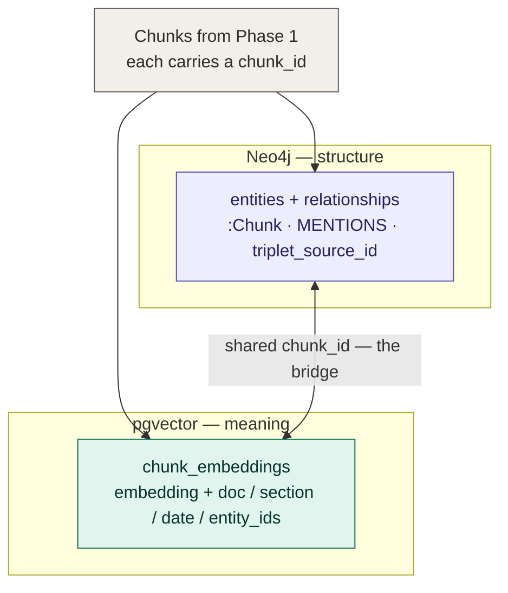

# Phase 2 — Build the vector index alongside the graph

**Status: complete.** Phase 2 builds a vector index (pgvector) alongside the
Neo4j graph, joined by a shared `chunk_id`, and measures its retrieval quality
so later work can stand on numbers rather than assumptions. That is the entire
scope of Phase 2 — the hybrid retriever, Text2Cypher, and grounded answer
generation are **later phases**, not part of Phase 2 (see §10).

Everything remains local and free (Ollama `bge-m3` for embeddings, Postgres +
pgvector, Neo4j).

---

## Table of contents
1. [Goal & the core idea](#1-goal--the-core-idea)
2. [Architecture: two stores, one key](#2-architecture-two-stores-one-key)
3. [Prerequisites & setup](#3-prerequisites--setup)
4. [The vector index (`vectorize.py`)](#4-the-vector-index-vectorizepy)
5. [The pgvector schema](#5-the-pgvector-schema)
6. [Crossing the bridge — both directions](#6-crossing-the-bridge--both-directions)
7. [Retrieval evaluation (`eval_retrieval.py`)](#7-retrieval-evaluation-eval_retrievalpy)
8. [Results we measured](#8-results-we-measured)
9. [Design decisions & rationale](#9-design-decisions--rationale)
10. [Beyond Phase 2 (later phases)](#10-beyond-phase-2-later-phases)
11. [File reference](#11-file-reference)

---

## 1. Goal & the core idea

Phase 1 built a knowledge graph. Phase 2 makes the corpus **retrievable** for
question answering, by adding a second store optimized for a different job:

- **Neo4j** answers *"how do these things relate?"* (structure) — but can't do
  fuzzy semantic matching.
- **pgvector** answers *"what text is relevant to this question?"* (meaning) —
  but is blind to structure.

The core idea is to run **both** and weld them with a shared key. The same
chunks Phase 1 wrote to Neo4j are embedded into pgvector, and **the `chunk_id`
is identical in both stores.** That shared key lets you enter through whichever
door fits the question and cross to the other side for free.

---

## 2. Architecture: two stores, one key



- **Vector search → graph:** a retrieved chunk hands you its `entity_ids`, which
  are entry nodes into the graph neighborhood.
- **Graph → text:** any edge's `triplet_source_id` is a `chunk_id` that pulls
  the exact justifying passage out of pgvector.

---

## 3. Prerequisites & setup

Adds one service to the Phase 1 stack: **Postgres + pgvector** (bundled in
`docker-compose.yml`, host port **5434** to avoid clashing with other local
Postgres instances).

```bash
ollama pull bge-m3           # embeddings (already used in Phase 1 resolution)
docker compose up -d postgres
pip install -r requirements.txt   # adds psycopg2-binary, pgvector
```

Connection (defaults, override in `.env`):
```
host=localhost  port=5434  db=kgrag  user=postgres  password=kgrag-password
```

---

## 4. The vector index (`vectorize.py`)

`python -m src.vectorize` reads the chunks Phase 1 wrote to Neo4j, enriches them,
embeds them, and upserts into pgvector. Per document:

1. **Read chunks from Neo4j** — `chunk_id`, `text`, and the `entity_ids` the
   chunk `MENTIONS` (`OPTIONAL MATCH (ch)-[:MENTIONS]->(e)`).
2. **Section path** — the cached filing is re-split into its Item 1 / Item 1A
   sections (`edgar.narrative_sections`); each chunk is tagged by which section
   a mid-chunk signature falls in (`10-K / Item 1 - Business`,
   `10-K / Item 1A - Risk Factors`, or `10-K / other` for boilerplate).
3. **Filing date** — parsed from the EDGAR document name
   (`edgar.latest_filing_date`, e.g. `aapl-20250927` → `2025-09-27`).
4. **Embed** — chunk text → `bge-m3` (1024-dim) via the shared
   `embeddings.embed_texts`.
5. **Upsert** — `INSERT … ON CONFLICT (chunk_id) DO UPDATE`, so re-running is
   idempotent (matching Phase 1's philosophy). Embeddings are written as
   `vector` literals cast with `::vector`.

The build also creates the extension, table, and an **HNSW** index on the
embedding (`vector_cosine_ops`).

---

## 5. The pgvector schema

```sql
CREATE TABLE chunk_embeddings (
    chunk_id     text PRIMARY KEY,   -- join key = Neo4j :Chunk id
    doc_id       text,               -- ticker (AAPL / MSFT / NVDA)
    section_path text,               -- 10-K / Item 1 - Business, etc.
    filing_date  date,               -- report/period date
    entity_ids   text[],             -- graph entities this chunk MENTIONS
    text         text,               -- chunk text (retrieval / citation)
    embedding    vector(1024)        -- bge-m3 embedding
);
CREATE INDEX chunk_embeddings_hnsw
    ON chunk_embeddings USING hnsw (embedding vector_cosine_ops);
```

Every row is *text + its meaning (embedding) + where it came from + which graph
things it touches* — which is exactly what makes a vector hit graph-aware.

---

## 6. Crossing the bridge — both directions

Both proven live on the real data.

**Direction 1 — retrieved passage → graph neighborhood.** A vector search for
supply-chain risk returns Apple's Item 1A chunk `15b03466…`; its `entity_ids`
open into the graph:
```
Taiwan                     ─OPERATES_IN→    Apple Inc.
Semiconductor Manufacturer ─HAS_SUBSIDIARY→ Apple Inc.
Contract Manufacturer      ─HAS_SUBSIDIARY→ Apple Inc.
```

**Direction 2 — graph path → original text.** Starting from an edge:
```
edge:         Apple Inc. ──HAS_SUBSIDIARY──▶ Component Manufacturers
its chunk_id: f5a695f0…  (from the edge's triplet_source_id)
text:         "The Company uses some custom components that are not
               commonly used by its competitors…"
```

Neither store alone can do this; the shared `chunk_id` is what makes the round
trip possible.

---

## 7. Retrieval evaluation (`eval_retrieval.py`)

**Rule we followed: do not build a router on retrieval you have not measured.**
Before adding anything on top, we measured two independent things:

- **recall@k** — did the embedding rank the known-relevant chunk(s) in the top
  k? (a property of the embedding + data)
- **ann_recall@k** — did HNSW return the same top-k as an exact brute-force
  scan? (a property of the index / `ef_search` — the ANN error)

The harness uses a **hand-labeled set** of 12 queries, each mapped to the
chunk id(s) that genuinely answer it, and sweeps pgvector's `hnsw.ef_search`
over `[10, 20, 40, 80, 160]`. Exact ground truth is obtained by forcing a
sequential scan (`enable_indexscan = off`).

---

## 8. Results we measured

12 labeled queries · k=5 · corpus = 27 chunks (3 filings):

| ef_search | recall@5 | ann_recall@5 | avg ms |
|---|---|---|---|
| 10 | 0.933 | 1.000 | 1.56 |
| 20 | 0.933 | 1.000 | 1.50 |
| 40 | 0.933 | 1.000 | 1.52 |
| 80 | 0.933 | 1.000 | 1.59 |
| 160 | 0.933 | 1.000 | 1.62 |

`recall@1 = 0.583` (7/12).

**Honest interpretation:**
1. **The HNSW index is correct.** `ann_recall@5 = 1.000` — HNSW returns exactly
   the brute-force top-5. Zero approximation error.
2. **`ef_search` cannot be meaningfully tuned at this scale.** The sweep is flat
   because 27 vectors is far below where HNSW approximates — the index is
   trivially exact for any `ef_search`. Tuning is **deferred until the corpus is
   thousands of chunks**, where a recall/latency tradeoff actually appears. The
   default stays at pgvector's `40`; re-run `eval_retrieval.py` at scale.
3. **Embedding quality is good.** recall@5 = 0.933 (14 of 15 labeled-relevant
   chunks in the top 5). The one partial miss — *"switching costs and platform
   lock-in"* — found the switching-costs chunk but not a generously-labeled
   second "network effects" chunk. recall@1 = 0.583 means the single best chunk
   is often rank 2–4, not rank 1.

**Gate decision:** retrieval is measured and good enough to build on — **but the
router must retrieve k ≥ 5**, not top-1 (recall@1 is too low to route on a
single hit). Caveats carried forward: the corpus is small, and `ef_search`
tuning is a standing to-do at scale.

---

## 9. Design decisions & rationale

- **Separate pgvector store, not Neo4j's vector index.** Keeps the vector
  workload in a store built for it, and makes the shared-key bridge explicit.
- **Rich chunk metadata** (`doc_id`, `section_path`, `filing_date`,
  `entity_ids`) — enables filtered retrieval (by company, section, or date) and
  the jump into the graph, not just raw similarity.
- **Idempotent upsert by `chunk_id`** — re-running never duplicates; the vector
  index stays consistent with the graph.
- **Measure before routing.** ANN recall and embedding recall are measured
  separately, so we know whether a future miss is an index problem or an
  embedding problem.
- **Refuse to over-claim `ef_search` tuning at 27 vectors** — the data says it's
  flat; fabricating a curve would be dishonest. The harness is ready for scale.

---

## 10. Beyond Phase 2 (later phases)

Phase 2 ends at the measured vector index. The following are **separate, later
phases** — listed here only so the direction is clear; none of them are part of
Phase 2:

- **Hybrid retriever** — vector top-k (k ≥ 5, the measured floor) → expand via
  `entity_ids` / `chunk_id` into the graph neighborhood → assemble grounded
  context.
- **Text2Cypher** — translate multi-hop / aggregation questions into Cypher the
  graph runs directly.
- **Grounded answer generation with citations** — using the
  `triplet_source_id` / `MENTIONS` provenance already in place.
- **Re-measure at scale** — scale the corpus, then re-run `eval_retrieval.py`
  and tune `ef_search` before trusting production latency/recall.

---

## 11. File reference

```
src/
├── embeddings.py      # local bge-m3 embeddings (shared with resolution)
├── vectorize.py       # build the pgvector index from graph chunks (entry point)
├── eval_retrieval.py  # labeled-set recall@k + ef_search sweep (the gate)
└── edgar.py           # + narrative_sections() and latest_filing_date() helpers
docker-compose.yml     # + Postgres/pgvector service on host port 5434
config.py              # + PG_* connection and VECTOR_DIM
```
