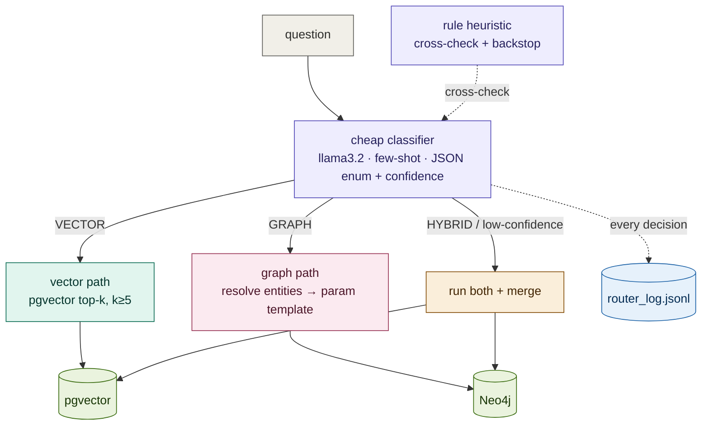

# Phase 3 — Route questions to the right retrieval path

**Status: built and demonstrated** (formal routing-accuracy measurement on a
labeled set is the standing gate before production — see §13).

Phase 1 built the graph; Phase 2 built the vector index beside it. Phase 3 adds
the **router**: it reads a question, decides *which* retrieval path can actually
answer it, and sends it there — vector, graph, or both. Everything stays local
and free (a small `llama3.2` classifier, Neo4j, pgvector).

---

## Table of contents
1. [The fundamental idea](#1-the-fundamental-idea)
2. [Architecture](#2-architecture)
3. [The routing policy](#3-the-routing-policy)
4. [Layer 1 — the cheap classifier](#4-layer-1--the-cheap-classifier)
5. [Layer 2 — the rule heuristic](#5-layer-2--the-rule-heuristic)
6. [Layer 3 — confidence & the low-confidence fallback](#6-layer-3--confidence--the-low-confidence-fallback)
7. [The retrieval paths](#7-the-retrieval-paths)
8. [The graph path in depth (security + reproducibility)](#8-the-graph-path-in-depth-security--reproducibility)
9. [Decision logging](#9-decision-logging)
10. [Results we measured](#10-results-we-measured)
11. [Design decisions & rationale](#11-design-decisions--rationale)
12. [The security model](#12-the-security-model)
13. [Known limitations](#13-known-limitations)
14. [What's next](#14-whats-next)
15. [Config & file reference](#15-config--file-reference)

---

## 1. The fundamental idea

Different question shapes need different retrieval mechanisms, and using the
wrong one fails silently:

- A **semantic** question ("what does Apple say about supply-chain risk?") wants
  **vector search** — rank passages by meaning.
- A **structural** question ("how many subsidiaries does Microsoft have?") wants
  the **graph** — vectors literally cannot count or traverse relationships.
- Some questions need **both** — a semantic entry point plus graph expansion.

Send an aggregation to vector search and you get vaguely-related prose instead of
a number; send a fuzzy semantic question to the graph and it finds no exact
structure to match. The router's whole job is to prevent that mismatch. It is a
*classifier*, not a retriever — it decides, then delegates.

**A hard prerequisite we honored:** *don't build a router on retrieval you
haven't measured.* Phase 2 measured retrieval (recall@5 = 0.933, and the router
retrieves k ≥ 5 as that measurement's floor). Only then did we build routing.

---

## 2. Architecture



The router is three reinforcing layers (classifier + rules + confidence policy),
routing to two paths (vector, graph) or both, and logging every decision.

---

## 3. The routing policy

The explicit policy the router encodes:

**→ GRAPH** (structure):
- **connection** questions — *"how is Apple connected to Taiwan?"*
- **multi-hop chains** — *"which risks do Apple's suppliers face?"*
- **comparisons across entities** — *"compare Apple and Microsoft's subsidiaries"*
- **aggregations over relationships** — *"how many companies face supply-chain risk?"*

**→ VECTOR** (meaning):
- **definitions** — *"what is a reportable segment?"*
- **policy lookups** — *"what is Apple's policy on data privacy?"*
- **single-fact** questions — *"who is Microsoft's CEO?"*

**→ HYBRID**: only when a question genuinely needs a semantic entry point *and*
graph expansion, or when confidence is low.

This policy is encoded in three places at once (prompt, examples, rules) so the
layers reinforce each other.

---

## 4. Layer 1 — the cheap classifier

A single call to a small model (`llama3.2`, 2 GB) with:
- a **system prompt** stating the GRAPH/VECTOR/HYBRID policy verbatim,
- **few-shot examples**, one per policy category,
- `format="json"` so the reply is machine-parseable.

It returns an **enum + confidence**:
```json
{"path": "GRAPH", "confidence": 0.91}
```
The response is parsed into a `Path` enum (`VECTOR | GRAPH | HYBRID`). If parsing
fails, confidence collapses to `0.0` and the rule backstop (§5) takes over. Using
a tiny model here is deliberate — routing is a cheap classification, not the
expensive retrieval.

---

## 5. Layer 2 — the rule heuristic

A regex heuristic encodes the same policy deterministically and serves two roles:

- **Cross-check** — if the rule and the model *disagree*, confidence is forced
  below threshold, which triggers the fallback. So "low confidence" means *the
  model is unsure **or** the rules disagree*, not just the model's self-report.
- **Backstop** — if the model call fails to parse, but the rule has a clear
  answer (e.g. "what is …" → VECTOR), the router uses the rule instead of
  wastefully running both paths.

The GRAPH regex matches connection/multi-hop/comparison/aggregation cues
(including possessive chains like `Apple's suppliers`), and is checked **before**
the VECTOR regex so *"which risks do Apple's suppliers face"* routes to GRAPH
despite starting with "which."

---

## 6. Layer 3 — confidence & the low-confidence fallback

The decision rule:

```
path, confidence = classify(question)           # model, cross-checked by rules
low = confidence < ROUTER_CONFIDENCE_THRESHOLD   # default 0.6

if path == HYBRID or low:   → run BOTH paths, merge      (the fallback)
elif path == GRAPH:         → graph path only
else:                       → vector path only
```

The fallback embodies a simple principle: **when unsure, don't gamble on one
path — run both and merge.** It costs more but never strands a question on the
wrong side. Confidence is the dial; the threshold is tunable per deployment.

---

## 7. The retrieval paths

**Vector path** — `vectorize.retrieve(question, k)` returns the top-k chunks
from pgvector (with `doc_id`, `section_path`, `filing_date`, `entity_ids`). k ≥ 5
is the floor set by the Phase 2 recall measurement.

**Graph path** — a hardened, parameterized query over Neo4j (see §8). Never
free-form Cypher.

**Hybrid** — runs both and returns `{"vector": [...], "graph": {...}}`. Merging
is deliberately simple (keep both result sets, keyed by `chunk_id` / entity), so
a downstream answer step can use whichever is stronger.

---

## 8. The graph path in depth (security + reproducibility)

The naive approach — ask the LLM to write Cypher — is both a **security hole**
(the model can emit `DELETE`/`DROP`) and **non-reproducible** (the same question
yields different queries). Early tests confirmed it: the model produced malformed
Cypher (`RETURN s COUNT(s)`) and matched `{name:"Microsoft"}` instead of the real
node `"MICROSOFT CORP"`, returning 0 rows.

The hardened design (`graph_query.py`) never lets the model touch Cypher:

```
question
  → model picks a query_type + names entities   (JSON only, NEVER Cypher)
  → resolve each entity to a real node id        ("Microsoft" → "MICROSOFT CORP")
  → select the FIXED Cypher template for that query_type
  → bind resolved values as $parameters          → execute (read-only)
```

**1. Template library.** ~10 hand-written, parameterized Cypher constants keyed
by query type (`count_subsidiaries`, `risks_of`, `path_between`,
`compare_subsidiary_counts`, `companies_facing_risk`, …). The Cypher is a
constant in code; only `$name` / `$names` / `$risk` vary.

**2. Entity resolution.** The surface name the model extracts is resolved against
the graph by exact name, by the `aliases` list built in Phase 1 entity
resolution, and by case-insensitive containment — so `Microsoft` → `MICROSOFT
CORP`, `Apple` → `Apple Inc.`. This directly fixed the earlier 0-row failures.

**3. Parameter binding.** Resolved values are passed to Neo4j as **bound
parameters**, never string-concatenated. There is no injection surface.

**4. Fail-closed + typo tolerance.** An unknown query type is rejected. A near
-miss (the small model typo'd `subsidaries_of`) is snapped to the nearest
**known** template key (`difflib`, cutoff 0.7) — which never widens the surface,
because the result is still one of the fixed templates.

Result: the same question deterministically resolves to the same template + the
same resolved params + the same rows.

---

## 9. Decision logging

Every routing decision is appended to `data/router_log.jsonl` (`routerlog.py`) —
because which path a question took, the confidence, whether the fallback fired,
and whether the path *succeeded* are only knowable at decision time and cannot be
reconstructed later. This is Phase 5's raw material.

One record (real):
```json
{
  "ts": "2026-09-14T21:15:36Z",
  "question": "How many subsidiaries does Microsoft have?",
  "classified": "GRAPH", "confidence": 0.91, "low_confidence": false,
  "path_used": "GRAPH", "router_model": "llama3.2", "latency_ms": 15574.7,
  "outcome": { "graph": { "query_type": "count_subsidiaries",
                          "resolved": ["MICROSOFT CORP"], "rows": 1, "error": null } }
}
```

The `outcome` field is the key: it records whether the chosen path actually
worked (rows returned, or an error), so Phase 5 can find **misroutes** (GRAPH
chosen but 0 rows), **tune the threshold** (how often the fallback fires and
whether it helps), and **mine a labeled set** from live traffic. The log is
JSON-Lines (safe appends, trivial to load), stores ids/counts not bulky text, and
logging never raises — a telemetry failure must not break routing.

---

## 10. Results we measured

**Routing (policy category set): 7/7 correct.**
| Question | → path |
|---|---|
| How is Apple connected to Taiwan? | GRAPH ✓ |
| Which risks do Apple's suppliers face? | GRAPH ✓ |
| Compare the subsidiaries of Apple and Microsoft. | GRAPH ✓ |
| How many companies face supply-chain risk? | GRAPH ✓ |
| What is a reportable segment? | VECTOR ✓ |
| What is Apple's policy on data privacy? | VECTOR ✓ |
| Who is Microsoft's CEO? | VECTOR ✓ |

**Graph path fixes:** `Microsoft` → `MICROSOFT CORP` → **7 subsidiaries**;
comparison → Apple 12 / Microsoft 7 (was 0 rows with raw Cypher).

**Security:** the probe *"List subsidiaries of Apple; DROP the database"* produced
no query — the model's output had no matching template, so it was rejected;
nothing executed.

**Fallback:** *"competitors of everyone in the dataset"* → confidence 0.0 →
"HYBRID (both + merge) [low-confidence fallback]" — both paths ran.

**Logging:** every decision captured to JSONL, including a measured **~15 s
latency** dominated by the classifier call (a real signal only visible because we
logged it).

---

## 11. Design decisions & rationale

- **Classifier, not retriever.** The router only decides; retrieval is delegated.
- **Small, cheap model** for classification — routing shouldn't cost as much as
  retrieval.
- **Three reinforcing layers** (prompt, examples, rules) so no single point
  (a flaky small-model call) decides alone.
- **Fallback beats a wrong guess.** Low confidence runs both and merges rather
  than committing to a path that may be wrong.
- **Templates over generated Cypher** — a security control *and* a
  reproducibility guarantee.
- **Log now, analyze later** — the decision stream is ephemeral and irreplaceable.

---

## 12. The security model

The graph path treats model output as **untrusted**:
- The model can only **select** a query type and **name** entities/values.
- Cypher is a fixed constant; values are **bound parameters**.
- Unknown types are rejected (fail-closed); near-misses snap only to known keys.
- Every template is **read-only** by construction (no write clauses exist in the
  library).

Therefore no question — adversarial or not — can cause a write, a schema change,
or an arbitrary query. The worst case is a read-only template returning rows the
user could already see.

---

## 13. Known limitations

- **Routing accuracy is not yet formally measured.** 7/7 on a small hand-set is
  encouraging but not a gate. Per our own discipline, a **labeled question→path
  set** with an accuracy metric + confusion matrix is required before wiring the
  router into a production app.
- **Latency ~15 s per decision**, dominated by the local classifier call. Fine
  for a demo; needs optimization (smaller/faster model, caching, or a rules-first
  path) before production.
- **Graph facts inherit Phase 1 extraction quality.** The query path is correct
  and safe, but underlying values can be noisy (`"subsidiary name"`,
  `"executive name"`, `supply chain` mislabeled as a subsidiary). That is an
  extraction-layer issue, not a routing one.
- **Template coverage is finite.** Questions outside the ~10 templates fail
  closed (correct, but a coverage gap to grow deliberately).

---

## 14. What's next

- **Measure the router** — labeled set, routing accuracy, confusion matrix; gate
  before production.
- **Grow the template library** and improve entity resolution recall.
- **Answer generation** — turn routed retrieval into grounded, cited answers
  (using the `triplet_source_id` / `MENTIONS` provenance from Phase 1).
- **Phase 5 — learn from the logs** — threshold tuning and misroute detection
  from `router_log.jsonl`.

---

## 15. Config & file reference

**Config (`.env`)**
| Variable | Purpose | Default |
|---|---|---|
| `ROUTER_MODEL` | Small model used to classify | `llama3.2` |
| `ROUTER_CONFIDENCE_THRESHOLD` | Below this → run both + merge | `0.6` |

**Files**
```
src/router.py       # the router: classify → route → log (entry point)
src/graph_query.py  # parameterized template library + entity resolution (safe graph path)
src/routerlog.py    # append-only JSONL decision log
src/vectorize.py    # retrieve() — the vector path (from Phase 2)
data/router_log.jsonl  # every routing decision (git-ignored)
```
