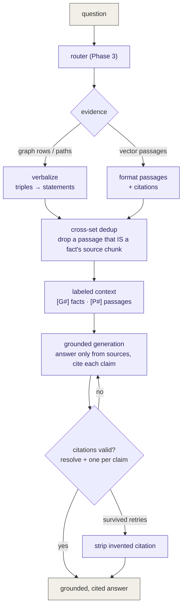

# Phase 4 — Merge both sources into one grounded answer

**Status: built and demonstrated.** Phase 4 is the answer layer: it takes the two
kinds of evidence the router returns — graph facts and vector passages — and
turns them into a single, grounded, **cited** answer, plus a Streamlit UI whose
visualization adapts to how the answer was produced. Everything is local and
free (a `llama3.1:8b` synthesizer, `bge-m3` embeddings, Neo4j, pgvector).

This document explains not just *what* each piece does but the *concept* behind
it — why it exists and what failure it prevents.

---

## Table of contents
1. [The fundamental idea](#1-the-fundamental-idea)
2. [Architecture](#2-architecture)
3. [Two shapes of evidence — and why neither can be prompted raw](#3-two-shapes-of-evidence)
4. [Verbalization — triples → statements](#4-verbalization)
5. [Passage formatting & citations](#5-passage-formatting--citations)
6. [Cross-set deduplication](#6-cross-set-deduplication)
7. [Explicit labeled context](#7-explicit-labeled-context)
8. [Grounded generation](#8-grounded-generation)
9. [Citation validation & reject-and-regenerate](#9-citation-validation--reject-and-regenerate)
10. [The adaptive frontend](#10-the-adaptive-frontend)
11. [End-to-end provenance](#11-end-to-end-provenance)
12. [Results we measured](#12-results-we-measured)
13. [Design decisions & rationale](#13-design-decisions--rationale)
14. [Known limitations](#14-known-limitations)
15. [Config & file reference](#15-config--file-reference)

---

## 1. The fundamental idea

The router (Phase 3) decides *where* to look and returns evidence. But evidence
is not an answer. A graph query returns rows like
`[{'company':'MICROSOFT CORP','count':7}]`; a vector search returns paragraphs of
10-K prose. A user wants one coherent sentence they can trust.

Phase 4's job is **synthesis with accountability**: fuse the two evidence shapes
into a readable answer where *every claim is backed by a citation that provably
points at real retrieved evidence*. The guiding concept is **grounding** — the
model may only assert what the sources support, and it must show its work.

---

## 2. Architecture



---

## 3. Two shapes of evidence

The router hands Phase 4 up to two things:

- **Graph evidence** — structured rows or paths (essentially triples):
  `(MICROSOFT CORP)-[HAS_SUBSIDIARY]->(…)`, or a count, or a path.
- **Vector evidence** — passages: raw chunk text with metadata.

**The concept: an LLM prompted with raw structured data writes bad prose.** Given
`[{'subsidiary':'Beats'}, {'subsidiary':'Didi'}]` a model tends to echo the data
structure ("The data shows subsidiary: Beats…") or hallucinate connective
tissue. Structured data and natural language are different modalities; you must
translate the first into the second *before* the model sees it. That translation
is verbalization (§4). Passages are already prose, so they need only citation
tagging (§5).

---

## 4. Verbalization

**Concept:** convert triples/paths into plain-English statements so the model
reads facts, not data structures.

`verbalize_graph()` ([src/answer.py](src/answer.py)) is **query-type aware** —
each template's rows have a known shape, so a tailored sentence is produced:

| Raw rows | Verbalized statement |
|---|---|
| `[{'company':'Apple','count':12},{'company':'MSFT','count':7}]` | "Apple Inc. has 12 subsidiaries." · "MICROSOFT CORP has 7 subsidiaries." |
| `[{'subsidiary':'Beats'}, …]` | "Apple Inc.'s subsidiaries include: Beats, …" |
| path `A→B→C` with rels `[R1,R2]` | "A has subsidiary B; B is regulated by C." |

For paths, a `REL_PHRASE` map turns each relationship type into a verb phrase
(`HAS_SUBSIDIARY` → "has subsidiary", `FACES_RISK` → "faces the risk"), so a
multi-hop chain reads as a sentence rather than arrow-notation. This is the exact
point where "raw triples generate awkward text" is prevented.

---

## 5. Passage formatting & citations

**Concept:** every passage must arrive with a **citable identity**, so a claim
built on it can point back precisely.

`format_passages()` renders each vector hit as `(citation, text)` where the
citation is `doc_id · section_path · filing_date · (chunk <id>)` — e.g.
`AAPL · 10-K / Item 1A - Risk Factors · 2025-09-27 (chunk 409687f7)`. The chunk
id is the anchor: it ties the passage back to Neo4j and to the exact source.

---

## 6. Cross-set deduplication

**Concept:** the two evidence sets can overlap, and presenting the same fact
twice makes the model **double-count** and pad the answer. Deduplicate across
the sets before prompting.

The realistic overlap: a graph fact was *derived from* a chunk, and the vector
search *also* returned that same chunk as a passage. To detect this precisely
(not by fuzzy text matching), each graph template now returns the edge's
`triplet_source_id` (`… RETURN … r.triplet_source_id AS _src`). That id **is** a
chunk id, comparable to the passages' `chunk_id`. So `_dedup_passages()` drops
any passage whose chunk already backs a graph fact:

```
graph risk fact ← derived from chunk ce94d47a
passages:        [ce94d47a, 409687f7, 11fd7951, 86e86a37]
DROPPED (redundant): [ce94d47a]      ← the distilled fact already covers it
KEPT:                [409687f7, 11fd7951, 86e86a37]
```

It also removes intra-set repeats (the same chunk returned twice). The distilled
graph fact wins over the raw passage behind it — higher signal, less text.

---

## 7. Explicit labeled context

**Concept:** structured facts and retrieved prose have different *epistemic
status* — a graph fact is precise (a count, an exact relationship); a passage is
descriptive. If you blend them into one undifferentiated list, the model can't
tell which to trust for what, and neither can the reader tracing a citation.

So the context is assembled into two **explicitly labeled blocks**, with distinct
citation namespaces:

```
GRAPH-DERIVED FACTS (from the knowledge graph):
  [G1] MICROSOFT CORP has 7 subsidiaries recorded in the graph.

RETRIEVED PASSAGES (from vector search):
  [P1] (AAPL · Item 1A · 2025-09-27 (chunk 409687f7)) The Company's operations
       are also subject to the risks of industrial accidents at its suppliers…
```

The system prompt tells the model the difference: *"prefer graph-derived facts
for counts and relationships, passages for explanations."* `[G#]` vs `[P#]` also
lets a reader see at a glance whether a claim rests on a structured fact or a
quoted passage.

---

## 8. Grounded generation

**Concept:** grounding = the model may assert **only** what the provided sources
support, and must **abstain** when they don't. This is what separates RAG from a
model answering from memory (and hallucinating).

The synthesis call (`ANSWER_MODEL`, default `llama3.1:8b`) is instructed to:
- use **only** the numbered sources,
- **cite every claim** with a `[G#]`/`[P#]` label,
- say "I don't have enough information" when the sources don't cover the question.

Abstention is a feature, not a failure — for a generic definition the filings
don't contain, the correct grounded answer is "not enough information," and the
UI shows exactly that.

---

## 9. Citation validation & reject-and-regenerate

**Concept — the most dangerous failure in cited RAG is a *citation that doesn't
exist*.** A confident answer citing `[P9]` when there is no P9 looks
authoritative and is completely fabricated. Instructing the model to cite is not
enough; you must **verify**.

The mechanism (`validate_citations` + the loop in `answer()`):
1. **Require a citation per claim** — every substantive sentence must carry a
   `[G#]`/`[P#]`; uncited claims are flagged.
2. **Validate resolution** — extract every cited label and check it is in the set
   of labels that were *actually in the context*. Any label not present is
   **invented**.
3. **Reject and regenerate** — on invalid/uncited output, feed the model a
   corrective message ("you cited [P9] which does not exist; you may only cite
   {…}") and regenerate, up to `ANSWER_MAX_RETRIES`.
4. **Fail-safe** — if a hallucinated citation somehow survives every retry, it is
   **stripped from the text**, so an invented source is never shown.

**Why "this costs nothing":** validation is regex + set membership — no model
call. A regeneration fires *only* on failure, which is rare; the common case
(valid on the first pass) costs zero. Proven: `[P9]` against sources `{P1,G1}` is
caught; a real answer validated in 1 pass with no retry; and in the live UI one
answer visibly took **3 passes** — the loop rejecting and regenerating until
every citation resolved.

The result carries `citations_valid`, `attempts`, and `uncited_claims`, so answer
quality is observable (and loggable, like the router log).

---

## 10. The adaptive frontend

**Concept:** show the *mechanism*, not just the answer. A user trusts a system
more when they can see which path answered and what evidence was used — and the
right visualization depends on the path.

[app.py](app.py) (Streamlit) renders three layers:
1. **Routing explanation** — Path used · Classified · Confidence, plus a
   plain-English "why this path."
2. **The answer** — with inline citations and a **validation badge** (green when
   every citation resolved, showing how many passes it took).
3. **Path-adaptive visualization** ("How it was answered"):

| Path | Visualization | Why this view |
|---|---|---|
| GRAPH (count) | a metric | the answer *is* a number |
| GRAPH (list / connection) | a node→edge diagram (graphviz from `graph_triples`) | show the traversed relationships |
| GRAPH (comparison) | a bar chart | compare magnitudes |
| VECTOR | similarity bar chart + passage cards | show *why* these passages (ranked by similarity) |
| HYBRID | both, in tabs | two kinds of evidence, side by side |

Proven live: a GRAPH question showed the metric "7" and `[G1]`; a VECTOR question
showed a similarity bar chart (0.61 → 0.54) with passage cards and `[P#]`
citations.

---

## 11. End-to-end provenance

Phase 4 completes a chain that began in Phase 1. A claim in the final answer
traces all the way back to a source sentence:

```
answer claim  →  [G1]/[P#] citation  →  a graph fact or a chunk
graph fact    →  triplet_source_id   →  the Chunk that justified the edge
passage       →  chunk_id            →  the Chunk (and its Neo4j node)
```

Because citations are *validated*, this chain cannot be faked — every link is a
real, retrieved object. That is the payoff of grounding + validation together:
**verifiable answers.**

---

## 12. Results we measured

- **Verbalization**: raw rows → clean statements ("MICROSOFT CORP has 7
  subsidiaries."), and multi-hop paths → sentences.
- **Cross-set dedup**: a passage that was a graph fact's source chunk
  (`ce94d47a`) was dropped from the passage set — proven with real ids.
- **Labeled context**: two blocks, `[G#]` facts and `[P#]` passages, cited
  distinctly in the answer.
- **Citation validation**: invented `[P9]` caught; clean answers validate in 1
  pass; a live UI answer regenerated over **3 passes** until valid.
- **Frontend**: GRAPH → metric/diagram, VECTOR → similarity bars + passages,
  proven in the running app.

---

## 13. Design decisions & rationale

- **Verbalize before prompting** — structured data and prose are different
  modalities; translating first is what yields natural answers.
- **Dedup on a real key (`triplet_source_id` = `chunk_id`)**, not fuzzy text —
  precise, cheap, and reuses Phase 1 provenance.
- **Label the two evidence kinds** — they have different epistemic status;
  blending them loses that.
- **Validate citations, don't just request them** — the only reliable defense
  against invented sources, and it's essentially free.
- **Abstention is correct behavior** — a grounded system must be allowed to say
  "not enough information."
- **A capable model for synthesis, a tiny model for routing** — spend compute
  where judgment is needed (fusing evidence), not on classification.
- **Adaptive visualization** — make the mechanism visible; different paths merit
  different views.

---

## 14. Known limitations

- **Answers inherit extraction quality.** Grounding guarantees a claim is
  supported by a source, not that the *source fact* is correct. Phase 1's local
  -model noise (`"subsidiary name"`, `supply chain` mislabeled as a subsidiary)
  still surfaces in list answers.
- **The graph planner is non-deterministic** — it sometimes mis-picks a template
  (e.g. `companies_facing_risk` for "what risks does Apple face"), so the `[G#]`
  block isn't always populated in the live hybrid flow. A Phase-3/graph concern,
  not a Phase-4 one.
- **Latency** — the first query is slow (~30–60s) while Ollama swaps between the
  router, embedding, and answer models; warm queries are faster.
- **Simple merge** — Phase 4 concatenates the two labeled sets; it does not yet
  re-rank or cross-reference facts against passages beyond dedup.

---

## 15. Config & file reference

**Config (`.env`)**
| Variable | Purpose | Default |
|---|---|---|
| `ANSWER_MODEL` | Model that synthesizes the grounded answer | `llama3.1:8b` |
| `ANSWER_MAX_RETRIES` | Reject-and-regenerate attempts for bad citations | `2` |

**Files**
```
src/answer.py       # verbalize + format + dedup + label + generate + validate (entry point)
src/graph_query.py  # templates now return triplet_source_id (_src) for cross-set dedup
app.py              # Streamlit UI with path-adaptive visualization
.claude/launch.json # launch config for `streamlit run app.py`
```
