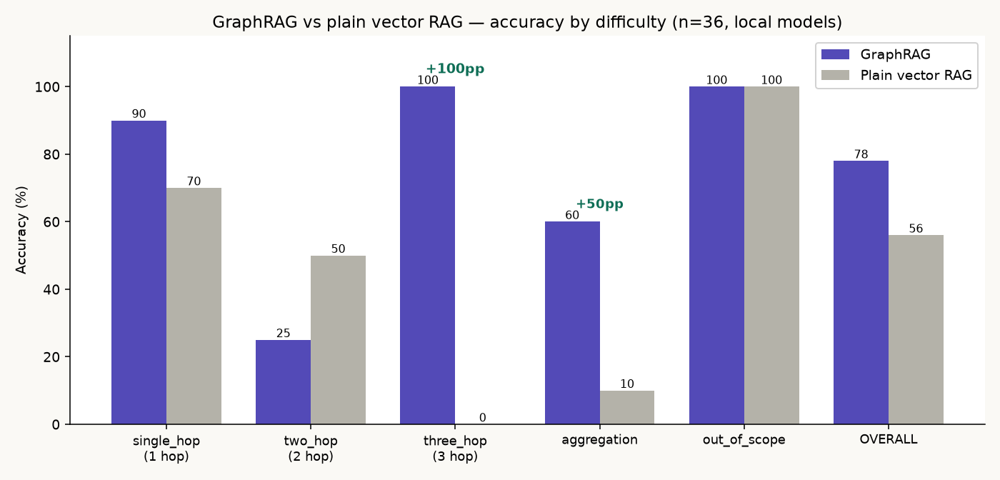

# KGRAG — Knowledge Graph RAG for Enterprise Data (SEC filings)

A local, open-source **GraphRAG** system that answers both *semantic* and
*structural* questions over enterprise documents — and refuses what it can't
support. It pairs a **knowledge graph** (Neo4j) with a **vector index**
(pgvector), joined by a shared `chunk_id`, routes each question to the right
store, and returns a **grounded, citation-validated** answer. Everything runs
free and on-device via Ollama.

## Benchmark — GraphRAG vs plain vector RAG

Same question set, same corpus, both systems grounded, all local models. Accuracy
by difficulty (n = 36):



| Difficulty | GraphRAG | Plain vector RAG | Delta |
|---|---|---|---|
| single_hop (1 hop) | 90% | 70% | +20pp |
| two_hop (2 hop) | 25% | 50% | −25pp |
| **three_hop (3 hop)** | **100%** | **0%** | **+100pp** |
| **aggregation** | **60%** | **10%** | **+50pp** |
| out_of_scope (should refuse) | 100% | 100% | +0pp |
| **Overall** | **78%** | **56%** | **+22pp** |

**The story:** rough parity on simple lookups, and a decisive win where it
matters — **three-hop (+100pp)** and **aggregation (+50pp)**, exactly the questions
vector search *structurally cannot* answer (it can't traverse relationships or
count). Both refuse out-of-scope questions equally, because both are grounded.

**The honest cost of that accuracy** — GraphRAG is slower per query and far more
expensive to build:

| | Plain vector RAG | GraphRAG |
|---|---|---|
| One-time ingestion (27 chunks) | **11.5 s** (embed only) | **~6–7 min** (LLM extraction + cleanup + entity resolution) |
| Latency / query (median, local) | **8 s** | **25 s** |
| Model calls / query | 2 (embed + answer) | 3–5 (router + graph plan + answer + citation checks) |
| API cost | $0 (local) | $0 (local) |

GraphRAG costs **~36× more to build** and **~3× more per query**. Stating that
plainly is what makes the accuracy claim credible.

**Honest caveats:** small corpus (3 filings / 27 chunks) and keyword-based
scoring. The `two_hop` dip is a genuine limitation — the query-template library
doesn't cover those specific 2-hop chains, so GraphRAG *correctly abstains* while
vanilla scores by keyword luck. Numbers are directional, not production-grade.
Reproduce with `python -m src.benchmark --all`.

---

## Architecture — five phases

| Phase | What it does | Entry point | Doc |
|---|---|---|---|
| **1 — Extraction** | EDGAR 10-K → schema-constrained entity/relationship extraction → Neo4j; then cleanup + entity resolution | `src/ingest.py` | [PHASE1.md](PHASE1.md) |
| **2 — Vector index** | Embed the same chunks into pgvector, tagged with doc/section/date/entity metadata (shared `chunk_id`) | `src/vectorize.py` | [PHASE2.md](PHASE2.md) |
| **3 — Router** | A cheap classifier sends each question to vector, graph, or both; parameterized (injection-safe) graph queries; every decision logged | `src/router.py` | [PHASE3.md](PHASE3.md) |
| **4 — Answer** | Verbalize graph facts + dedupe against passages → one labeled context → grounded answer with **validated citations** | `src/answer.py` | [PHASE4.md](PHASE4.md) |
| **5 — Benchmark** | GraphRAG vs plain vector RAG on a difficulty-stratified set; latency + cost reported | `src/benchmark.py` | (this README, top) |

See [ARCHITECTURE.md](ARCHITECTURE.md) for the full design and diagrams.

```
EDGAR 10-K → chunk ─┬─ embed ───────────────→ pgvector (meaning)
                    └─ extract entities+rels → Neo4j (structure)
                              (shared chunk_id joins the two)

question → router → { vector | graph | both } → merge + verbalize
                 → grounded answer with validated citations
```

## Prerequisites
- Python 3.10+
- Docker (runs Neo4j + Postgres/pgvector locally)
- [Ollama](https://ollama.com) (runs all models locally, free)

## Setup

1. **Install Ollama and pull the models**
   ```bash
   ollama pull llama3.1:8b   # extraction + answer generation
   ollama pull llama3.2      # the cheap router classifier
   ollama pull bge-m3        # embeddings (vectors + entity resolution)
   ```

2. **Config**
   ```bash
   cp .env.example .env
   ```
   Edit `.env`: set a real `SEC_USER_AGENT` (SEC requires a name + contact email,
   e.g. `Jane Doe jane@acme.com`). No API key needed for the local stack.

3. **Install Python deps**
   ```bash
   pip install -r requirements.txt
   ```

4. **Start the databases**
   ```bash
   docker compose up -d          # Neo4j (7474/7687) + Postgres/pgvector (5434)
   ```
   Neo4j Browser: http://localhost:7474 (neo4j / kgrag-password).

## Run it end to end

### Phase 1 — build the graph
```bash
python -m src.budget  --tickers AAPL MSFT NVDA   # pre-flight cost/time estimate
python -m src.ingest  --tickers AAPL MSFT NVDA   # extract → Neo4j (hash-cached)
python -m src.cleanup                            # drop junk + merge exact dupes
python -m src.resolve --dry-run                  # preview fuzzy-merge scores
python -m src.resolve                            # merge (Acme Corp == ACME) + aliases
python -m src.verify                             # Cypher sanity checks
```

### Phase 2 — build the vector index
```bash
python -m src.vectorize --query "supply chain and manufacturing risk"
```
`--query` runs a demo similarity search after building. Idempotent (upsert by
`chunk_id`).

### Phase 3 — route a question
```bash
python -m src.router     # demo: routes several questions to vector/graph/both
```

### Phase 4 — get a grounded, cited answer
```bash
python -m src.answer     # demo: full grounded answers with [G#]/[P#] citations
```

### The frontend (Streamlit)
A UI whose visualization adapts to how the answer was produced (graph diagram /
similarity bars / hybrid tabs):
```bash
streamlit run app.py     # http://localhost:8501
```

### Phase 5 — benchmark
```bash
python -m src.benchmark          # fast demo subset
python -m src.benchmark --all    # full stratified set
```

## Evaluation harnesses
- `python -m src.eval_retrieval` — retrieval recall@k + HNSW `ef_search` sweep.
- `python -m src.eval_router` — routing accuracy on a labeled question set + confusion matrix.

## Using a paid model safely (Claude, hosted APIs)
Everything runs local/free, but if you swap in a paid model the cost guardrails
protect you automatically:
- Known paid models are **auto-priced** (`src/pricing.py`) even if you never set
  `PRICE_PER_1M_*`; a `$0` estimate on a paid model is treated as unsafe.
- `src.ingest` runs a **built-in budget gate**: on any non-free model it prints
  the estimate, **blocks** above `BUDGET_LIMIT_USD`, and otherwise refuses to
  spend without `--yes`.
- Local Ollama passes the gate silently (`$0`), so free runs have no friction.

## Configuration (`.env`) & tuning
| Variable | Purpose | Default |
|---|---|---|
| `OLLAMA_MODEL` | Extraction model | `llama3.1:8b` |
| `ANSWER_MODEL` | Answer synthesis model | `llama3.1:8b` |
| `ROUTER_MODEL` | Cheap router classifier | `llama3.2` |
| `EMBED_MODEL` | Embeddings | `bge-m3` |
| `MAX_FILING_CHARS` | Per-filing extraction cap | `20000` |
| `RESOLVE_THRESHOLD` | Cosine cutoff for entity merges | `0.90` |
| `ROUTER_CONFIDENCE_THRESHOLD` | Below this → run both paths | `0.60` |
| `ANSWER_MAX_RETRIES` | Reject-and-regenerate on bad citations | `2` |
| `NEO4J_*` / `PG_*` | DB connections | see `.env.example` |
| `PRICE_PER_1M_*` / `BUDGET_LIMIT_USD` | Cost model / ceiling for paid models | `0` / `10` |

Downloaded filing text is cached under `data/`, and extraction results are cached
by **document hash** (`data/ingest_manifest.json`) — re-running never
re-downloads or re-extracts unchanged filings.

## Project layout
```
config.py            # env-driven configuration
docker-compose.yml   # Neo4j + APOC, Postgres + pgvector
app.py               # Streamlit UI (path-adaptive visualization)
src/
├── schema.py        # SEC ontology (entities, relations, validation)
├── edgar.py         # EDGAR download + narrative-section extraction
├── pricing.py       # per-model price presets (cost safety)
├── cache.py         # document-hash cache / manifest
├── budget.py        # pre-flight cost/time estimator + ceiling
├── ingest.py        # Phase 1: extraction → Neo4j (entry point)
├── cleanup.py       # junk removal + exact-duplicate merge
├── resolve.py       # entity resolution (embedding dedupe + aliases)
├── embeddings.py    # local bge-m3 embeddings (shared)
├── vectorize.py     # Phase 2: build the pgvector index
├── verify.py        # Cypher sanity checks
├── graph_query.py   # Phase 3: parameterized template library (safe graph path)
├── router.py        # Phase 3: classify → route → log
├── routerlog.py     # append-only routing decision log
├── answer.py        # Phase 4: verbalize + dedupe + label + generate + validate
├── benchmark.py     # Phase 5: GraphRAG vs plain vector RAG
├── eval_retrieval.py# recall@k + ef_search sweep
└── eval_router.py   # routing accuracy + confusion matrix
```

## Honest limitations
- **Local-model extraction is noisy.** The strict schema filters invalid *shapes*
  but not wrong *values* (`"subsidiary name"`, a product mislabeled as a
  subsidiary). A bigger model or a verification pass would help.
- **Small corpus** (3 filings) — everything above is directional, not
  production-grade.
- **The graph query planner is non-deterministic** and its template library is
  finite; unusual multi-hop questions fail closed (safe, but a coverage gap).
- **Latency** — the first query is slow while Ollama swaps models; warm queries
  are faster.

## Documentation
- [ARCHITECTURE.md](ARCHITECTURE.md) — full system design + diagrams
- [PHASE1.md](PHASE1.md) · [PHASE2.md](PHASE2.md) · [PHASE3.md](PHASE3.md) · [PHASE4.md](PHASE4.md) — detailed per-phase references
